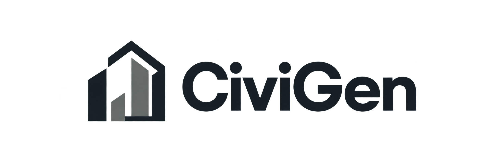
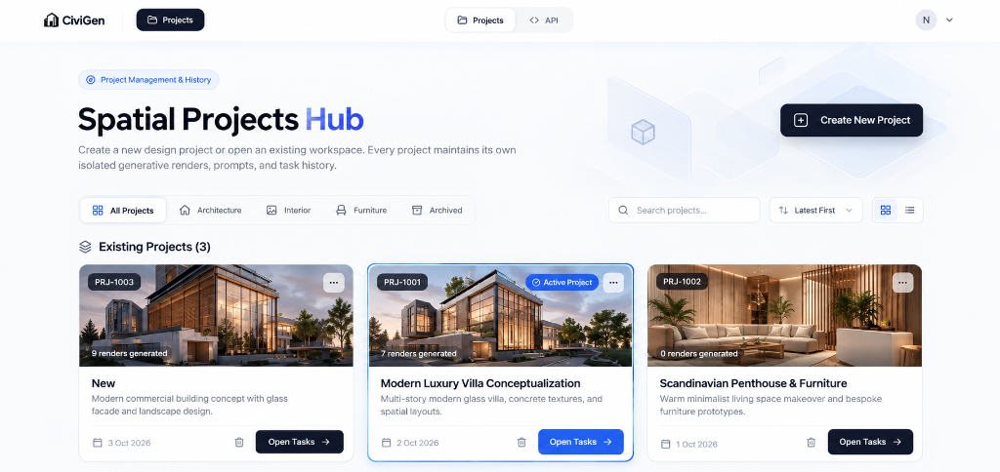
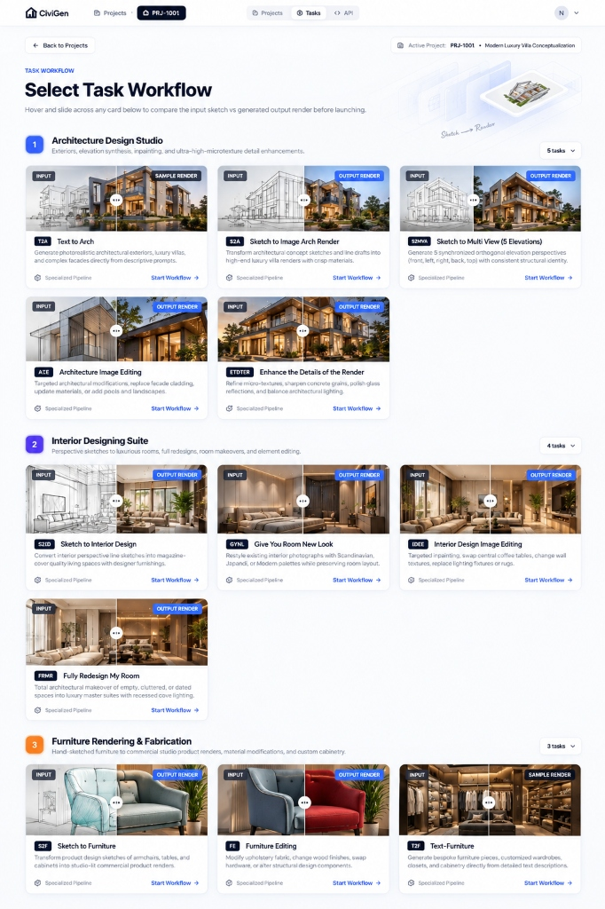
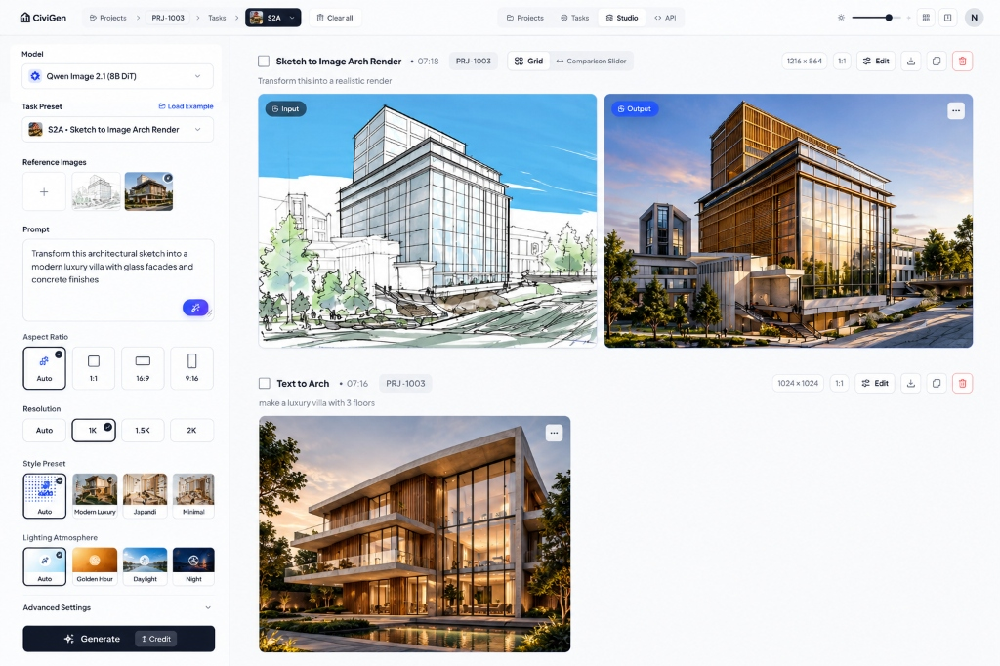
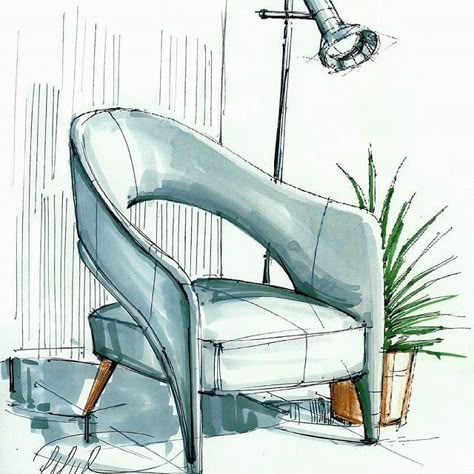
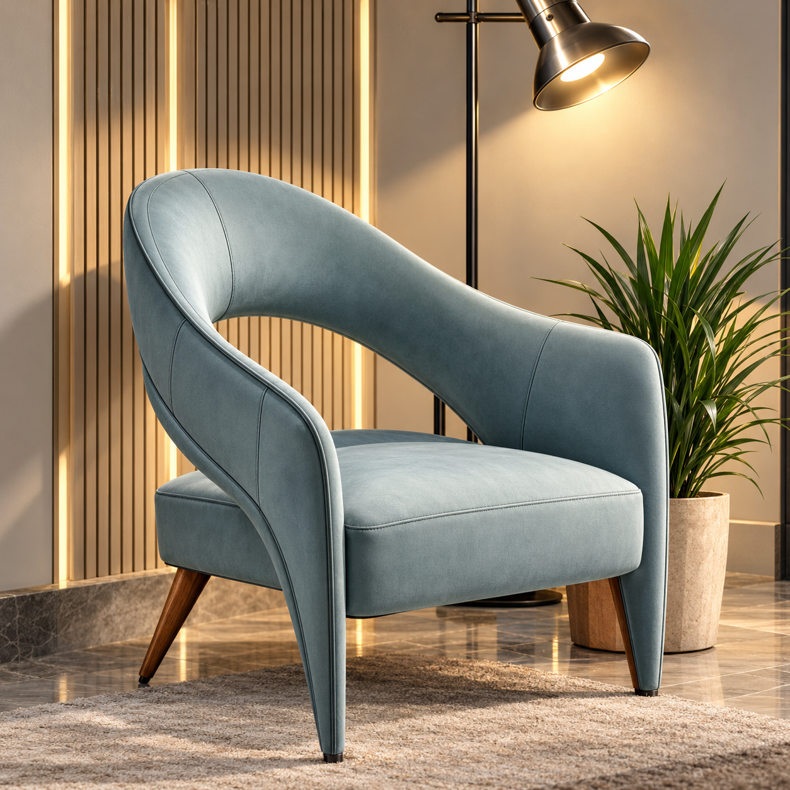

<div align="center">



### Generative Architectural Design Studio & Spatial Synthesizer
*Next-Generation Parametric Architecture, Interior Remodeling & Furniture Synthesis*  
*Powered by **Qwen Image 2.1 (8B DiT)** • Sequential Memory Offloading (6GB VRAM) • Multi-Device Cross-Platform*

[](https://www.python.org/)
[](https://pytorch.org/)
[-8A2BE2.svg)](https://huggingface.co/Comfy-Org/Qwen-Image-2.1)
[](https://fastapi.tiangolo.com/)
[](https://react.dev/)
[](docker-compose.yml)
[](LICENSE)
[]()

<br/>

[🏛️ Overview](#-what-is-civigen) •
[🖥️ Interface Tour](#-software-interface-tour) •
[📸 Visual Showcase](#-visual-generative-showcase) •
[⚡ System Requirements](#-system-requirements--6gb-vram-mode) •
[📥 Model Downloads](#-required-model-downloads) •
[🚀 Quick Start](#-quick-start-guide) •
[🐳 Docker Setup](#-docker-quickstart-nvidia-gpu) •
[📱 Multi-Device LAN](#-multi-device--mobile-access-lan-wi-fi) •
[⚖️ License](#-license--terms-of-use)

</div>

---

## 🏛️ What is CiviGen?

**CiviGen** is a production-grade, state-of-the-art generative design studio tailored for architects, interior designers, and visualization artists. It bridges the gap between hand-drawn sketches, CAD line drawings, and photorealistic architectural visualizations.

By utilizing **Qwen Image 2.1 (8B Diffusion Transformer)** coupled with **Qwen3-VL 8B multimodal vision-language text encoding**, CiviGen preserves spatial boundaries, structural walls, window placements, and geometric envelopes while rendering ultra-realistic materials (Calacatta marble, charred Shou Sugi Ban timber, polished micro-cement, floor-to-ceiling double-glazed facades).

---

## 🖥️ Software Interface Tour

Experience a studio-grade interface built with **React 19, TypeScript, and modern responsive design** — fully functional on desktop workstations, iPads/tablets, and mobile phones.

### 1. Spatial Projects Hub
Organize conceptual projects, client portfolios, and isolated generative histories.
<div align="center">
  
</div>

<br/>

### 2. 12 Synchronized Architectural Pipelines
Select specialized workflows with real-time interactive split sliders to preview input sketches vs. generated renders.
<div align="center">
  
</div>

<br/>

### 3. Studio Generative Workspace
Fine-tune prompt styling, lighting atmosphere (Golden Hour, Daylight, Night), resolutions (1K, 1.5K, 2K), and reference images with live generation streams.
<div align="center">
  
</div>

---

## 📸 Visual Generative Showcase

<div align="center">

### Exterior Architecture: Napkin Sketch to Photorealistic Villa (`S2A`)
| Input Concept Sketch | High-End Qwen 8B DiT Render Output |
| :---: | :---: |
|  |  |

### Interior Architecture: Room Makeover & Lighting Redesign (`GYRNL`)
| Room Envelope Before | Luxury Material, Finish & Lighting Overhaul |
| :---: | :---: |
|  |  |

### Bespoke Furniture: Product Sketch to Commercial Render (`S2F`)
| Industrial Furniture Sketch | Studio-Lit Commercial Product Render |
| :---: | :---: |
|  |  |

</div>

---

## ✨ Key Capabilities & Pipelines

CiviGen comes pre-configured with **12 synchronized generative workflows**:

| Pipeline ID | Pipeline Name | Description |
| :--- | :--- | :--- |
| **`T2A`** | **Text to Architecture** | Transform descriptive architectural briefs into full-scale building concepts. |
| **`S2A`** | **Sketch to Architecture** | Turn rough napkin sketches or CAD line drawings into photorealistic renders with live comparison slider. |
| **`AIE`** | **Architecture Image Enhancer** | Targeted architectural inpainting: replace cladding, add timber louvers, update pool landscaping. |
| **`ETDOTR`** | **Detail Enhancement (4K)** | Micro-texture latent refinement for hyper-crisp stone veining, glass reflections, and wood grains. |
| **`S2MVA`** | **Sketch to Multi-View (5 Elevations)** | Generate 5 synchronized orthogonal elevation perspectives (front, left, right, back, top) from a single sketch. |
| **`S2ID`** | **Sketch to Interior Design** | Convert perspective drawings into magazine-cover quality living spaces and designer furnishings. |
| **`GYRNL`** | **Give Your Room New Look** | Restyle existing interiors (Scandinavian, Japandi, Minimalist) while strictly locking room walls. |
| **`IDIE`** | **Interior Image Editing** | In-place modifications: swap central coffee tables, change wall textures, replace lighting fixtures. |
| **`FRMR`** | **Fully Redesign My Room** | Autonomous architectural overhaul of empty or cluttered spaces into luxury suites with cove lighting. |
| **`S2F`** | **Sketch to Furniture** | Transform concept sketches of armchairs, tables, and cabinets into commercial product renders. |
| **`FE`** | **Furniture Editing** | Modify upholstery fabric, wood finishes, metal hardware, or swap structural components. |
| **`T2F`** | **Text to Furniture** | Generate bespoke furniture pieces and custom cabinetry directly from detailed text descriptions. |

---

## ⚡ System Requirements & 6GB VRAM Mode

CiviGen uses **sequential model offloading** and **tiled VAE decoding** to drop hardware requirements from standard 24 GB down to **6 GB VRAM**.

| Component | Standard Mode (Fastest) | Low-VRAM Mode (`--low-vram`) |
| :--- | :--- | :--- |
| **GPU (NVIDIA)** | **12 GB – 16 GB+ VRAM**<br/>*(RTX 3060 12GB, RTX 4070, RTX 5070, RTX 4080/4090)* | **6 GB – 8 GB VRAM**<br/>*(RTX 2060, RTX 3060 Laptop, RTX 4050, RTX 4060 8GB)* |
| **System RAM** | 16 GB DDR4/DDR5 | 16 GB minimum (32 GB recommended for sequential CPU offloading) |
| **Disk Space** | ~18 GB for Qwen model weights | ~18 GB for Qwen model weights |
| **CUDA Version** | CUDA 12.1, 12.4, or 12.6 | CUDA 12.1, 12.4, or 12.6 |
| **Operating System** | Windows 10/11 64-bit or Linux (Ubuntu 22.04+) | Windows 10/11 64-bit or Linux (Ubuntu 22.04+) |

> **💡 How Low-VRAM Mode Works (6GB VRAM)**:
> In Low-VRAM mode (`civigen --low-vram`), the 9.35 GB multimodal text-vision encoder is evaluated in CPU memory or loaded temporarily and immediately purged from VRAM (`torch.cuda.empty_cache()`) before the 8B DiT diffusion model executes. Tiled VAE processes latents in small chunks, keeping peak VRAM **under 6 GB** even when generating high-resolution architectural images!

---

## 📥 Required Model Downloads

Download the following **3 model files** and place them in the `MODELS/Qwen/` directory:

| Model Component | Filename | Size | Target Folder | Direct Hugging Face Download Link |
| :--- | :--- | :--- | :--- | :--- |
| **Diffusion DiT (INT8)** | `qwen_image_2.1_int8_convrot.safetensors` | 7.26 GB | `MODELS/Qwen/` | [⬇️ Direct Download (Comfy-Org)](https://huggingface.co/Comfy-Org/Qwen-Image-2.1/resolve/main/diffusion_models/qwen_image_2.1_int8_convrot.safetensors) |
| **Text-Vision Encoder (INT8)** | `qwen3vl_8b_int8_convrot.safetensors` | 9.35 GB | `MODELS/Qwen/` | [⬇️ Direct Download (Comfy-Org)](https://huggingface.co/Comfy-Org/Qwen-Image-2.1/resolve/main/text_encoders/qwen3vl_8b_int8_convrot.safetensors) |
| **VAE (BF16)** | `qwen_image_2.1_vae_bf16.safetensors` | 675 MB | `MODELS/Qwen/` | [⬇️ Direct Download (Comfy-Org)](https://huggingface.co/Comfy-Org/Qwen-Image-2.1/resolve/main/vae/qwen_image_2.1_vae_bf16.safetensors) |

### Quick CLI Download (Optional)
If you have `huggingface-cli` installed:
```bash
huggingface-cli download Comfy-Org/Qwen-Image-2.1 diffusion_models/qwen_image_2.1_int8_convrot.safetensors --local-dir MODELS/Qwen --local-dir-use-symlinks False
huggingface-cli download Comfy-Org/Qwen-Image-2.1 text_encoders/qwen3vl_8b_int8_convrot.safetensors --local-dir MODELS/Qwen --local-dir-use-symlinks False
huggingface-cli download Comfy-Org/Qwen-Image-2.1 vae/qwen_image_2.1_vae_bf16.safetensors --local-dir MODELS/Qwen --local-dir-use-symlinks False
```

---

## 🚀 Quick Start Guide

### Option A: The Unified `civigen` CLI (Recommended)

1. **Clone the repository**:
   ```bash
   git clone https://github.com/Nawazwariya182/CiviGen.git
   cd CiviGen
   ```

2. **1-Click Environment Setup** (Windows):
   Double-click `setup_env.bat` or run:
   ```cmd
   setup_env.bat
   ```
   *(This automatically creates `.venv`, installs PyTorch with CUDA 12.4, installs dependencies, and prepares the core engine).*

3. **Start CiviGen**:
   ```cmd
   civigen
   ```
   *For 6GB–8GB GPUs, add the low-VRAM flag:*
   ```cmd
   civigen --low-vram
   ```
   *Your browser will automatically open to `http://localhost:8000`!*

---

### Option B: Standalone Executable (`civigen.exe`)

1. Compile the standalone executable:
   ```cmd
   build_exe.bat
   ```
2. Double-click `civigen.exe` to launch the server and open the studio interface in your default browser.

---

## 🐳 Docker Quickstart (NVIDIA GPU)

CiviGen provides turnkey Docker support via `Dockerfile` and `docker-compose.yml`. You do not need to install Python or CUDA toolkits on your host machine — only the **NVIDIA Container Toolkit**.

### 1. Prerequisites
- Docker Engine 24.0+ and Docker Compose v2+
- [NVIDIA Container Toolkit](https://docs.nvidia.com/datacenter/cloud-native/container-toolkit/latest/install-guide.html) installed on the host.

### 2. Verify GPU Access
```bash
docker compose run --rm civigen nvidia-smi
```

### 3. Launch CiviGen in Docker
```bash
# Start container in background
docker compose up -d

# View live generation logs
docker compose logs -f
```
Open **`http://localhost:8000`** in your browser.

### 4. Enable Low-VRAM (6GB) in Docker
Edit `docker-compose.yml` or launch with environment variable:
```bash
CIVIGEN_LOW_VRAM=1 docker compose up -d
```

> **Note**: Your host `MODELS/` directory is automatically mounted into the container as a volume, so you **never** have to copy or duplicate 17 GB weights inside the Docker image!

---

## 📱 Multi-Device & Mobile Access (LAN Wi-Fi)

CiviGen binds to `0.0.0.0:8000` on startup and resolves your local network IP:

```text
======================================================================
  CIVIGEN — Generative Architectural Design Studio (Qwen 8B DiT)
======================================================================
  • Desktop Browser:   http://localhost:8000
  • Mobile & Tablet:   http://192.168.0.104:8000
    (Open on any phone or tablet connected to your Wi-Fi!)
======================================================================
```

* **Mobile Optimized**: CiviGen features an ergonomic **bottom navigation bar**, single-column high-resolution card feeds, and **touch-enabled before/after sliders**.
* Anyone on your home or studio Wi-Fi can open the Mobile URL to generate, prompt, and review architectural models in real-time.

---

## ❓ Frequently Asked Questions

### Do I need to install or run ComfyUI?
* **Desktop / Web Interface**: **NO.** You do **NOT** need the ComfyUI desktop application or interface. CiviGen provides its own custom, high-end React 19 studio interface.
* **Underlying Engine**: CiviGen uses ComfyUI's core modular library (`comfy.sd`, `comfy.sample`, `comfy.model_management`) under the hood to handle VRAM memory management and quantized DiT execution. `setup_env.bat` and `Dockerfile` handle this automatically with zero manual configuration.

### How do I use the OpenAI / GPT-Compatible API?
CiviGen exposes full OpenAI SDK-compatible endpoints on port 8000:

```python
from openai import OpenAI

client = OpenAI(
    base_url="http://localhost:8000/v1",
    api_key="sk-civigen-local"
)

response = client.chat.completions.create(
    model="qwen-image-2.1",
    messages=[
        {"role": "user", "content": "Brutalist concrete museum on a cliffside, golden hour daylight, 8k render"}
    ],
    extra_body={
        "task": "arch_text_to_arch",
        "width": 1024,
        "height": 1024
    }
)

print(response.choices[0].message.content)
```

---

## ⚖️ License & Legal Protection

CiviGen is licensed under the **CiviGen Source-Available & Non-Commercial License** (incorporating principles of PolyForm Noncommercial 1.0.0 and Creative Commons BY-NC-ND 4.0; see full text in [`LICENSE`](LICENSE)):

* **Free for Individuals**: Personal use, architectural research, academic education, non-commercial portfolio projects, and personal experimentation are **100% free forever**.
* **Corporate / Closed-Source Ban**: Commercial corporations and closed-source proprietary software products may **NOT** use, embed, resell, or distribute CiviGen without a separate commercial agreement.
* **No Closed Derivatives**: You may not distribute modified, proprietary, or closed-source forks.

> **Legal Note**:
> Under international copyright law (Berne Convention) and US/international legal statutes, original software code and architecture are protected by copyright immediately upon creation. No filing fees or external registrations are required for this license to be legally binding on users who clone, download, or use this repository.

For commercial licensing or enterprise customization inquiries, contact the repository maintainers.
